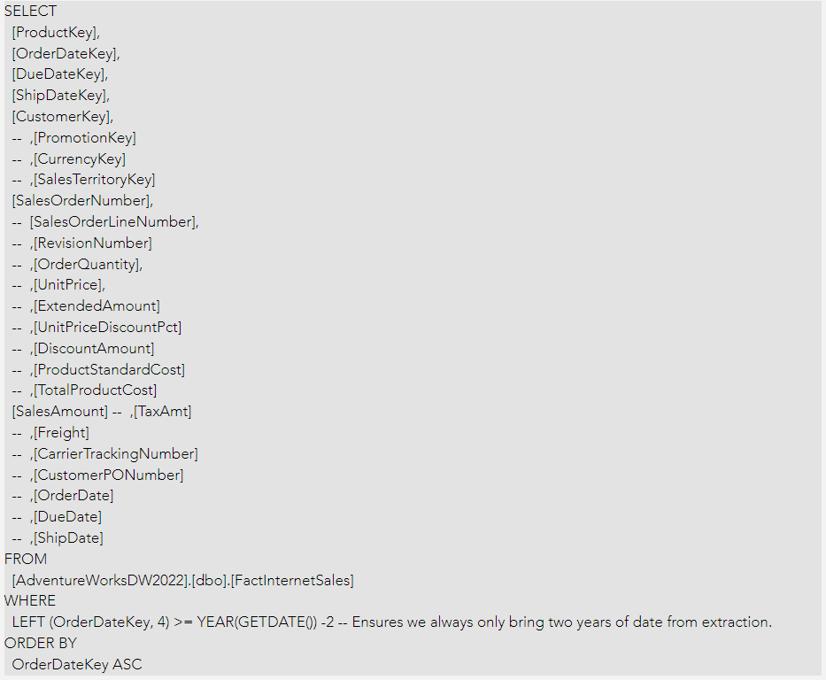
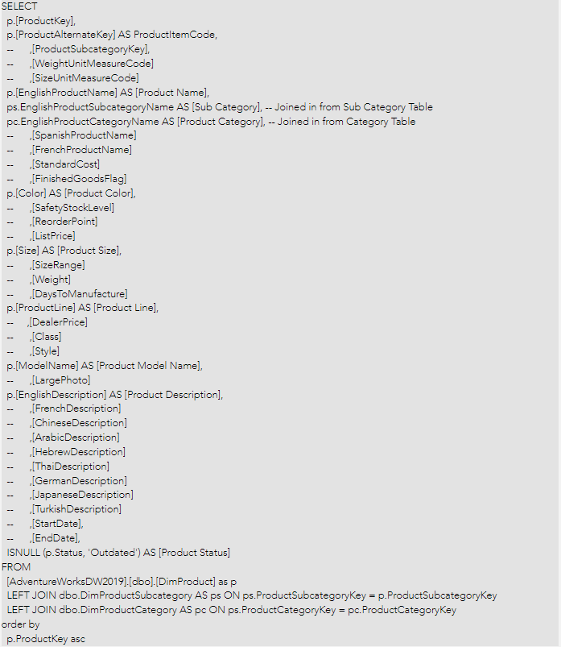
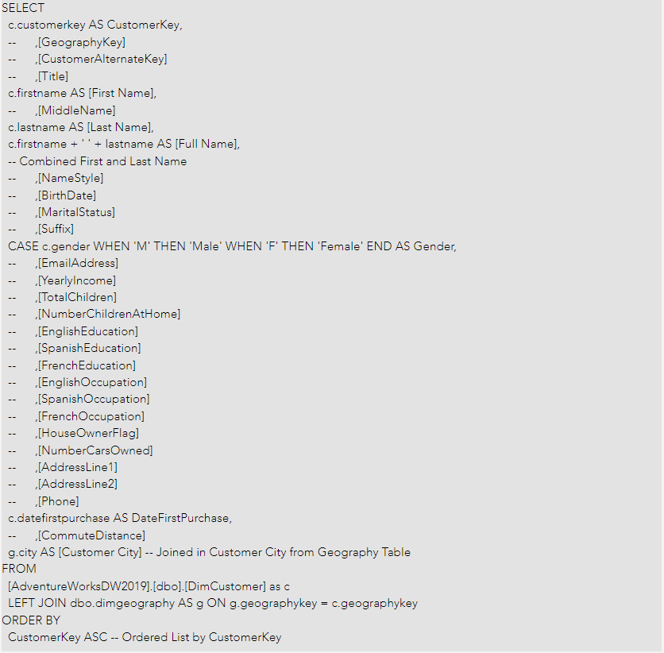
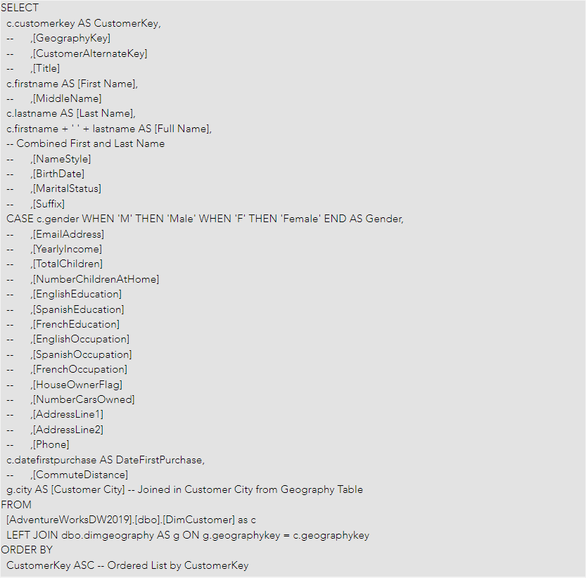
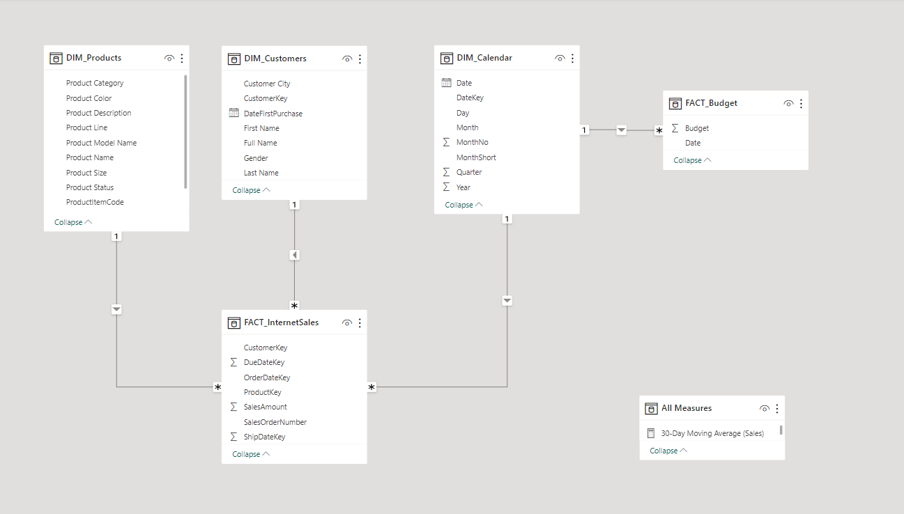
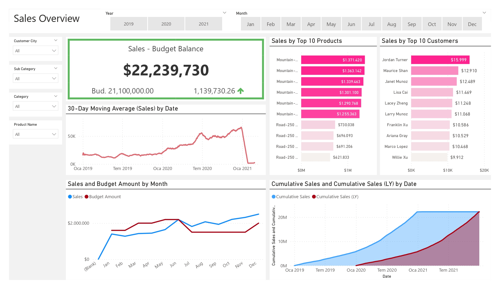
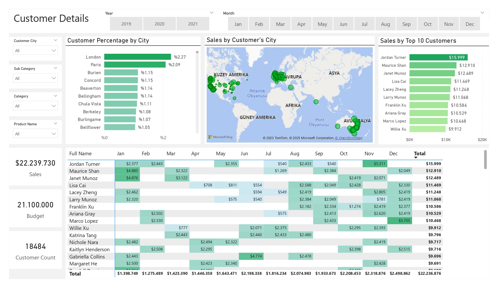
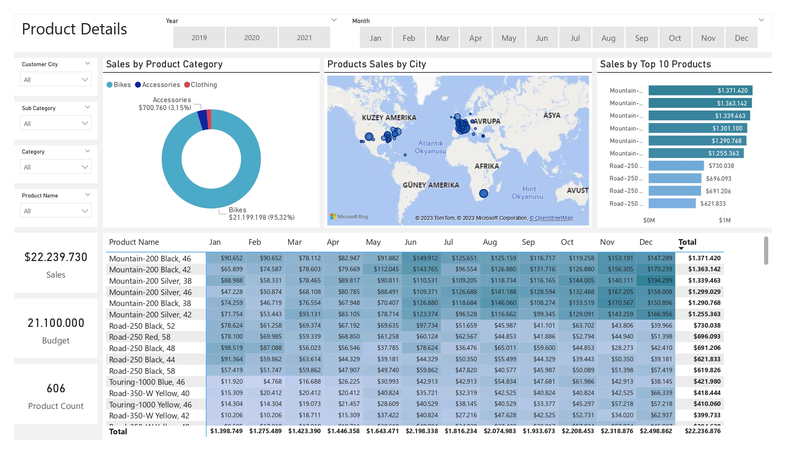

# Bicycles and Components Sales Analysis

 
 

## Introduction

Sales data for bicycles and components is abundant, but the challenge lies in making sense of this data to optimize sales strategies and improve business performance. The goal of this project is to create a comprehensive sales dashboard using **SQL** and **Power BI**, allowing the Sales Management Team to comprehend and interpret the data effectively. By doing so, demands such as Product Performance, Customer Preferences and Sales Trends were addressed, and aimed guiding the team in making data-driven decisions to boost sales and revenue.

 

## Problem Statement

* Which of our customers rank in the top 10 in terms of sales ?
* Which of our products rank in the top 10 in terms of sales ?
* What are the monthly sales and budget values, and how do they vary over time ?
* How do cumulative sales and cumulative sales form the last year change over time ? 
* What is the last 30-day moving average of sales for the most recent period ?
* What is the total sales, total budget, total product count, and total customer count ?
* What is the distribution of cities where our customers located ?
* How are sales distributed across customer cities ?
* How are sales distributed based on the locations where porducts are sold ?
* How is the sales distribution across product categories in terms of percentiles ?
* What are the total sales of each product for every month ? 
* What are the total sales to each customer for every month ? 

 

## Skills & Features Demonstrated in MSSQL and Power BI:

- MSSQL Quaries

- Power Query

- Filters

- Slicers

- DAX Functions: 

     * DIVIDE()

     * CALCULATE()

     * FILTER()

     * ALLSELECTED()

     * DISTINCTCOUNT()

     * SUM()

     * MAX()

     * AVERAGEX()

     * DATESINPERIOD()

     * LASTDATE()

     * REMOVEFILTERS()

     * COUNTX()

     * DATEADD()
       
 

## Data Sourcing

I obtained the data from Microsoft sites. The data ise a sample database known as AdventureWorks. I imported the data into MSSQL and performed data cleaning transactions. 

 
​
Final tables are as follow:

1. FACT_InternetSales with 58.168 rows and 7 columns

2. FACT_Budget with 18 rows and 2 columns

3. DIM_Products with 606 rows and 11 columns

4. DIM_Customers with 18.484 rows and 7 columns

5. DIM_Calendar with 1.096 rows and 8 columns

​ 

## Data Transforming & Cleaning

To perform a meaningful analysis the required columns were extracted to create new data model tables from AdventureWork database tables using MSSQL. 
​ 

SQL statements for cleaning and transforming necessary data as follows:
​ 
 

**FACT_InternetSales:**
 

 
 

**DIM_Products:**
 

 
 

**DIM_Customers:**
 

 
 

**DIM_Calendar:**
 

 
 

## Data Model
Once the tables were created, they were all imported into Power BI, and connections between the tables were established. 
 
​
The FACT_Budget table was imported from an Excel file and connected within the data model in Power BI.
 

Below down you can see the data model of this project.
 

 

## Measures Created
Measures were created to enhance the formation of charts and cards for visualization. Measures for this project are as follow: 
  
  

- 30-Day Moving Average (Sales) = 
AVERAGEX(DATESINPERIOD(DIM_Calendar[Date],LASTDATE(DIM_Calendar[Date]),-30,DAY),
[Sales]
)
 

- All Customer Count = 
CALCULATE(
DISTINCTCOUNT(DIM_Customers[CustomerKey]),
REMOVEFILTERS(DIM_Customers[Customer City]))
 

- Budget Amount = SUM(FACT_Budget[Budget])
 

- Cumulative Sales = 
CALCULATE(
    [Sales],
    FILTER(
        ALLSELECTED(DIM_Calendar[Date]),
        DIM_Calendar[Date] <= MAX(DIM_Calendar[Date])))
 

- Cumulative Sales (LY) = 
CALCULATE(
    [Sales (LY)],
    FILTER(
        ALLSELECTED(DIM_Calendar[Date]),
        DIM_Calendar[Date] <= MAX(DIM_Calendar[Date])))
 

- Customer Count = COUNTX(DIM_Customers,DIM_Customers[CustomerKey])
 

- Prc. Of Customers = DIVIDE([Customer Count],[All Customer Count],0)
 

- Product Count = DISTINCTCOUNT(DIM_Products[ProductKey])
 

- Sales = SUM(FACT_InternetSales[SalesAmount])
 

- Sales - Budget = [Sales] - [Budget Amount]
 

- Sales (LY) = 
CALCULATE(
    [Sales],
    DATEADD(DIM_Calendar[Date],-1,YEAR))
 

- Sales / Budget Amount = DIVIDE([Sales],[Budget Amount],0)
  
 

## Analysis & Visualization
After the creation of the measures, the dashboard was compeleted. First page of the dashboard provides an overview of the company's sales. On the second page, you will find a detailed breakdown of sales with customer-specific insights, while the third page delves into product-spesific sales details.
 
 

[Click here to open the dashboard and try it out yourself!](https://app.powerbi.com/view?r=eyJrIjoiMjA0YjU3YTctZDk1NS00MmQzLWI1ZGItY2VmMWQxY2ZjMGMzIiwidCI6IjQwM2RmZTQxLWU5NmMtNDkwYy05NTZmLWY0NzZjMGI5MDA1OSIsImMiOjl9)

 
 

 
 

The insights obtained from the dashboard are as follows:
 
​
1. Until June, the budget consistently exceeded sales. However, after the middle of the June, sales was above on budget till the end of the year.

2. The cumulative sales are higher than the cumulative sales from last year at all times.

3. The 30-day moving average of sales consistently increased over time until January 2021. After that point, it dramatically decrased. 

4. The best-selling product is the **Mountain-200 Black, 46** with nearly $1,4 million in revenue.

5. The customer with the highest spending is **Jorden Turner**, totaling $16,000.

6. **London** was the city with the most customers with a share of 2.27%.

7. Sales from the **bicycle category** constituted **95%** of the total revenue while the clothing category constituted %1.53.

8. **Europa** has the highest purchasing power among all continents.
 

## Conclusions & Recommendations

* The positive difference in cumulative sales compared to the cumulative sales from the previous year indicates a favorable trend for the company in terms of increasing their sales.

* Countries with higher economic prosperity are more inclined to purchase bicycles and their components. The correlation between economic prosperity and the likelihood of having a hobby may explain why sales are not as high in other countries.

* The Accessories and Clothing category have the lowest sales. A strategic focus on improving the sales of these product categories may significantly contribute to the overall sales.
 

 

This documentation has been prepared to help you understand the project effectively. If you have any questions or feedback, please don't hesitate to let me know.
Thank you for your time and consideration!
 

Reference: https://www.youtube.com/playlist?list=PLMfXakCUhXsEUtk8c0zWr4whamGxLhAu0

Data Source: https://learn.microsoft.com/en-us/sql/samples/adventureworks-install-configure?view=sql-server-ver15&tabs=ssms

 
 

